# Lesson 11 Sales and Operational Planning & Resources Planning

<show-structure for="chapter" depth="2"/>

<format style="bold"> Test is based off the content of weeks 7-12 </format>
## Lecture Outline
<format style="bold">	Sales and Operational Planning </format>
-	The Sales and Operations Planning Process
-	Strategies for Adjusting Capacity
-	Strategies for Managing Demand
-	Quantitative Techniques for Aggregate Planning
-	Hierarchical Nature of Planning
-	Aggregate Planning for Services

<format style="bold">Resource Planning </format>
-	Material Requirements Planning (MRP)
-	Capacity Requirements Planning (CRP)
-	Enterprise Resource Planning (ERP)
-	Customer Relationship Management (CRM)
-	Supply Chain Management (SCM)

## Sales and Operations Planning
-	Determines resource capacity to meet demand over an intermediate time horizon
-	Aggregate refers to sales and operations planning for product lines or families
-	Sales and Operations planning (S&OP) matches supply and demand
-	Sales & Operational Planning Objectives
-	Establish a company wide plan for allocating resources
-	Develop an economic strategy for meeting demand

### Why Use Aggregate Planning
-	Why do organizations need to do aggregate planning?
-	Planning
    - It takes time to implement plans
  -	Strategic
      - Aggregation is important because it is not possible to predict with accuracy the timing and volume of demand for individual items
-	It is connected to the budgeting process

It can help synchrnize flow throughout the supply chain; it affects costs, equipment utilization, employment levels, and customer satisfaction

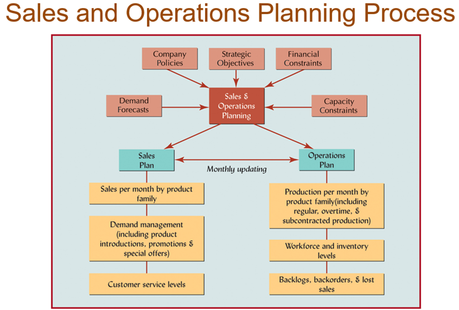

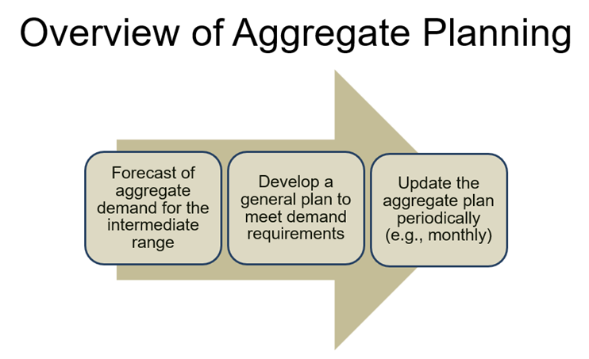

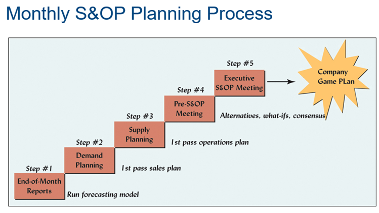

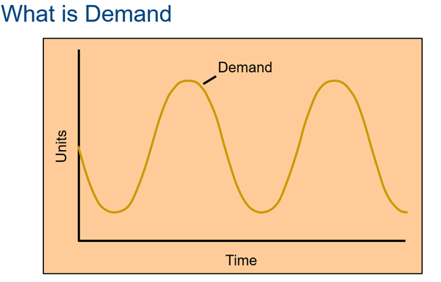

### Meeting Demand Strategies
<format style="bold">	Adjusting capacity </format>
- Resources to meet demand are acquired and maintained over the time horizon of the plan
- Minor variations in demand are handled with overtime or under-time

<format style="bold">	Managing demand </format>
- Proactive demand management

### Strategies for Managing Demand

#### Proactive demand management
- Partnering with suppliers to reduce information distortion along the supply chain
- 	Offering products or services with counter-cyclical demand patterns
-	Shifting demand into other time periods
	 - Incentives
	 - Sales promotions
	 - Advertising campaigns

### Strategies for Adjusting Capacity
<format style="bold">Level production </format>

1. Producing at a constant rate and using inventory to absorb fluctuations in demand

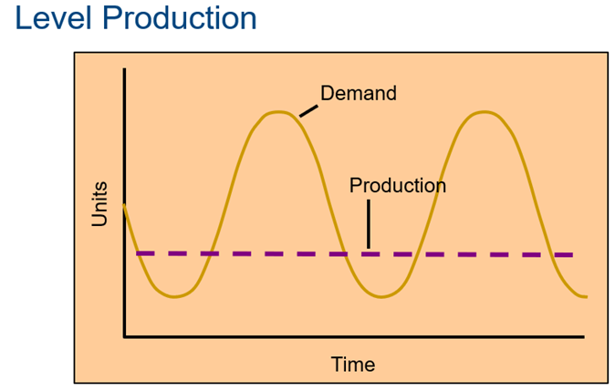

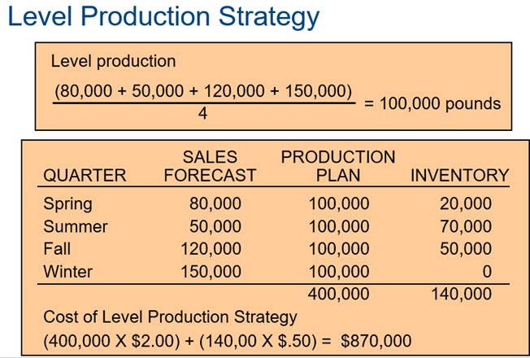

<format style="bold">Chase demand </format>

2. Hiring and firing workers to match demand

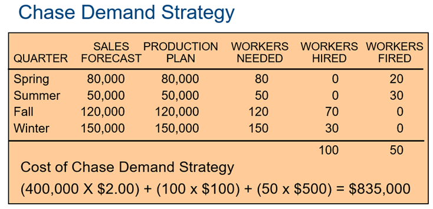

<format style="bold">Peak demand</format>

3. Maintaining resources (staffing) for high levels of customer service

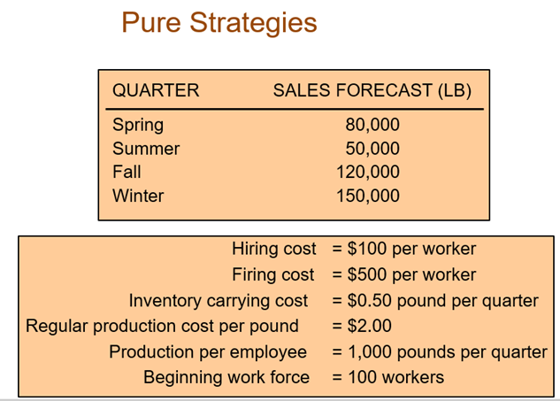

<format style="bold">Overtime and under-time</format>

4. Increase or decrease working hours

<format style="bold">Subcontracting</format>

5. Let outside companies complete the work (outsource)

<format style="bold">Part-time workers</format>

6. Hire part-time workers to complete the work

<format style="bold">Backordering</format>

7. Provide the service or product at a later time period

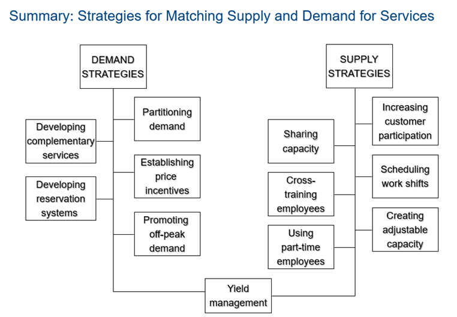

### Other Production Strategies:
#### Mixed Strategy
-	Combination of Level Production and Chase Demand strategies
-	Example policies
-	no more than x% of workforce can be laid off in one quarter
-	inventory levels cannot exceed x dollars
-	Some industries may shut down manufacturing during the low demand season and schedule employee vacations during that time
#### Collaborative Planning
-	Sharing information and synchronizing production across supply chain
-	Part of CPFR (collaborative planning, forecasting, and replenishment)
-	involves selecting products to be jointly managed, creating a single forecast of customer demand, and synchronizing production across supply chain
#### Disaggregation
-	Breaking an Aggregate Plan into more detailed plans
- Create Master Production Schedule for Material Requirements Planning

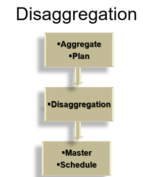

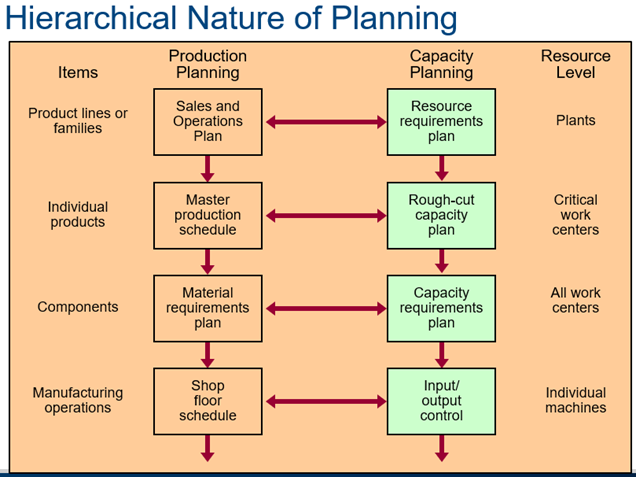

### Aggregate Planning for Services
-	Most services cannot be inventoried
-	Demand for services is difficult to predict
-	Capacity is also difficult to predict
-	Service capacity must be provided at the appropriate place and time
Labor is usually the most constraining resource for services

### Aggregate Planning in Services
<format style="bold">	Hospitals: </format>
- Aggregate planning used to allocate funds, staff, and supplies to meet the demands of patients for their medical services

<format style="bold">Airlines: </format>
- Aggregate planning in this environment is complex due to the number of factors involved
- Capacity decisions must take into account the percentage of seats to be allocated to various fare classes in order to maximize profit or yield

<format style="bold">Restaurants:</format>
- Aggregate planning in high-volume businesses is directed toward smoothing the service rate, determining workforce size, and managing demand to match a fixed capacity
- Can use inventory; however, it is perishable

### Yield Management
-	An approach to maximizing revenue by using a strategy of variable pricing; prices are set relative to capacity availability
-	During periods of low demand, price discounts are offered
-	During periods of peak demand, higher prices are charged
-	Users of yield management include
Airlines, restaurants, hotels, restaurants

## Resource Planning:
-	Material Requirements Planning (MRP)
-	Capacity Requirements Planning (CRP)
-	Enterprise Resource Planning (ERP)
-	Customer Relationship Management (CRM)
-	Supply Chain Management (SCM)

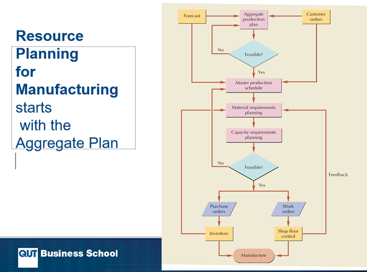

### Material Requirements Planning (MRP)
<format style="bold">Computerized inventory control and production planning system</format>

<format style="bold">When to use MRP?</format>
-	Dependent demand items
-	Discrete demand items
-	Complex products
-	Job shop production
-	Assemble-to-order environments

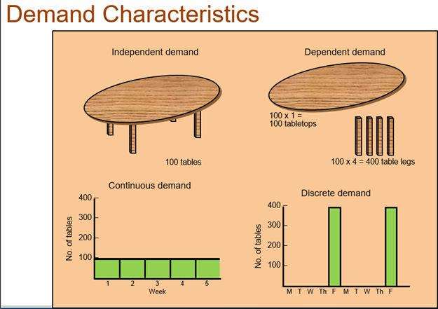

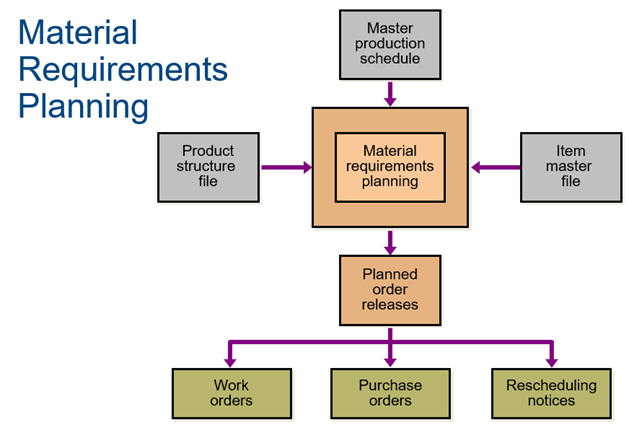

#### MRP Inputs and Outputs
<format style="bold">Inputs</format>
- Master production schedule	
- Product structure file
-	Item master file

<format style="bold">Outputs</format>
- Planned order releases
 	- Work orders
	- Purchase orders
	- Rescheduling notices

### Calculating Capacity
- Maximum capability to produce
- Rated Capacity (theoretical capacity)
   - Theoretical output that could be attained if a process were operating at full speed without interruption, exceptions, or downtime
- Effective Capacity
	- Takes into account the efficiency with which a particular product or customer can be processed and the utilization of the scheduled hours or work

-	Utilization
	 - Percent of available time spent working
-	Efficiency
	 - How well a machine or worker performs compared to a standard output level
	   

- Load
	- Standard hours of work assigned to a facility
- Load Percent
  	- Ratio of load to capacity

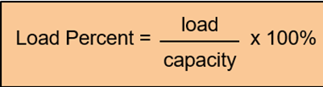

#### Example: Copy Courier
- Two high-speed copiers that can be operated by one operator.
- 2 shifts per day
-	8 hours/shift , 5 days/week.
-	No breaks during the day
-	30 minutes for lunch or dinner
-	Machine service time = 30 minutes at the beginning of each shift
-	Machine efficiency = 90%.
-	Capacity

- 2 copiers * 2 shifts * 8 hrs/shift * 7/8 utilization * .90 efficiency = 1512 minutes/day

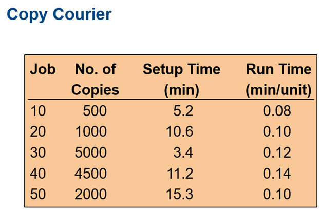

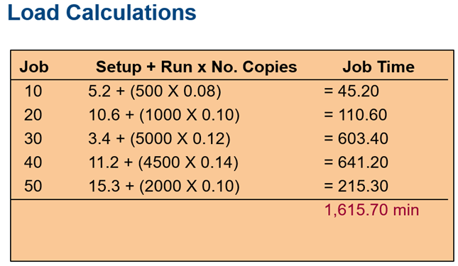

<format style="bold" color="Aqua">Loading</format>

<format style="bold">Capacity </format>

<format style="bold" color="red">2 copiers</format> * <format style="bold" color="Green">2 shifts </format> * <format style="bold" color="green">8 hrs/shift </format> * <format style="bold" color="Blue">7/8 utilization</format> * <format style="bold" color="Brown">.90 efficiency</format> = 
<format style="bold" color="Aqua">1512 minutes/day</format>

<format style="bold" color="PeachPuff">Load percent</format> = 1615.70/1512 = 1.068 X 100% = 106.8%

Overloaded by 6.8%.

Solution Alternative: <format style="bold" color="green">Extends working day by approximately 36 minutes</format>

Load percent = <format style="bold" color="blue">99%.</format>

Increase efficiency to <format style="bold" color="brown">97%.</format>

### Reducing Over-load Conditions
-	Eliminate unnecessary requirements
-	Reroute jobs to alternative machines, workers, or work centers
-	Split lots between two or more machines
-	Increase normal capacity
-	Subcontract
-	Increase efficiency of the operation
-	Push work back to later time periods
-	Revise master schedule

### Load Profiles
-	Graphical comparison of load versus capacity
-	Leveling underloaded conditions:
	 - Acquire more work
	 - Pull work ahead that is scheduled for later time periods
	 - Reduce normal capacity
-	Load leveling
	 - Process of balancing underloads and overloads
 
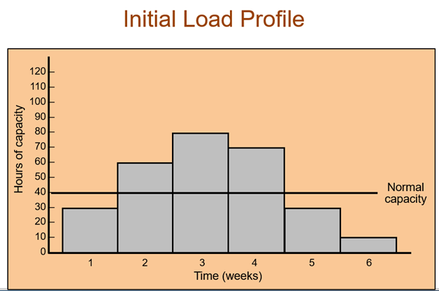
