# Lesson 8 Supply chain management: strategy and Design

<show-structure for="chapter" depth="2"/>

## Lecture Outline
Supply Chain – Value Chain – Global Supply Chain 
- The Management of Supply Chains
-	Green Supply Chains
-	Information Technology: A Supply Chain Enabler
-	Procurement & E-Procurement
-	Distribution
-	Transportation
-	The Global Supply Chain

## Supply Chains 
-	The facilities, functions, and activities involved in producing and delivering a product 
or service from suppliers to customers
-	An integrated group of processes to “source,” “make,” and “deliver” products

## Logistics:
-	The part of a supply chain involved with the forward and 
reverse flow of goods, services, cash, and information.

## The differnt types of supply chains 
### Typical supply chain
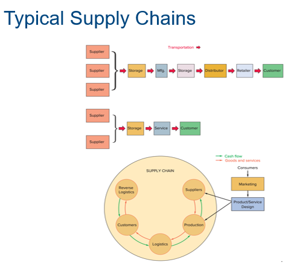

### The Supply chain structure
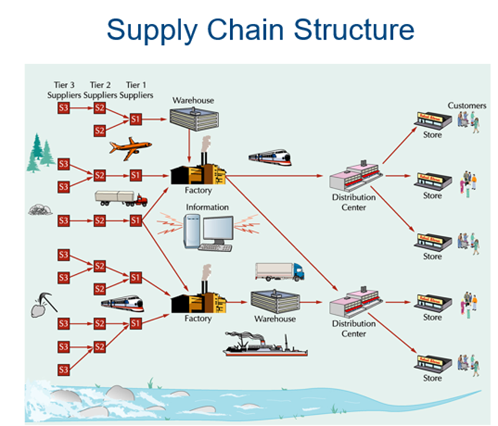

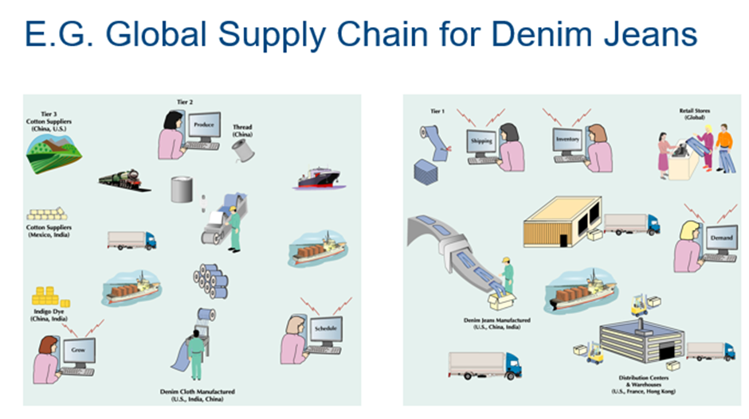

### Supply chain processes 
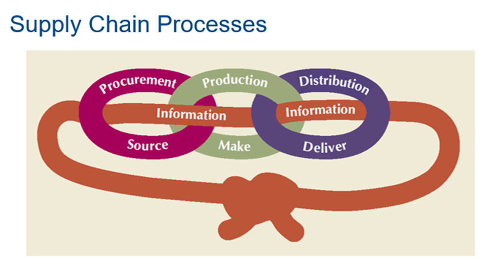

## Supply Chains for Service Providers
- More difficult than manufacturing
-	Does not focus on the flow of physical goods
-	Focuses on human resources and support services
-	More compact and less extended

## The value chain {id="ValueChainBegin"}
-	The value chain describes the categories of activities within an organisation, which, together, create a product or service.
-	The value chain consists of five primary activities (which are directly concerned with the creation or delivery of a product or service) and four support activities (which help to improve the effectiveness or efficiency of primary activities).
-	Competitive advantage can be analysed in any of these activities.
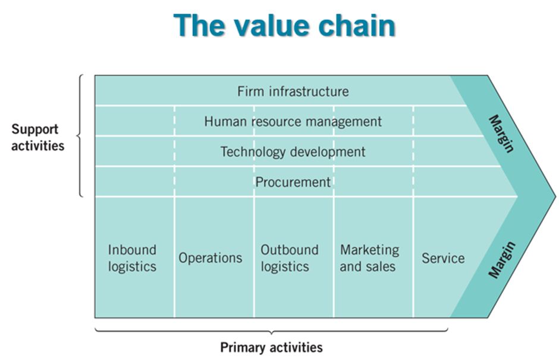

### Value Chains 
  <format style="bold"> Value chain </format> 
-	Broader than supply chain
-	Customer management
-	New product innovation
-	Post-sales support
-	Change management

<format style="bold">	Demand-driven value chain </format>
-	Supply management
-	Demand management
-	Product management

## Supply Chain Management (SCM) {id="SCM_id"}
- The strategic coordination of business functions within a business 
organization and throughout its supply chain for the purpose of integrating supply
and demand management (Stevenson, 2021)

- Managing flow of information through supply chain in order to attain the level of synchronization that will make it more responsive to customer needs while lowering costs
-	Keys to effective SCM
-	information
-	communication
-	cooperation
-	Trust

## Supply Chain {id="SupplyChainBegin_id"}
### Uncertainty and Inventory
<format style="bold">	A major objective of SCM: </format>
-	respond to uncertainty in customer demand without creating costly excess inventory

<format style="bold">	Negative effects of uncertainty </format>
-	lateness
-	incomplete orders

<format style="bold">Inventory </format>
-	insurance against supply chain uncertainty

### Supply Chain Uncertainty and Inventory
<format style="bold">	Factors that contribute to uncertainty</format>
-	inaccurate demand forecasting
-	long variable lead times
-	late deliveries
-	incomplete shipments
-	product changes
-	batch ordering
-	price fluctuations and discounts
-	inflated orders

 <format style="bold">Bullwhip Effect </format> 
-	Occurs when slight demand variability is magnified as information moves back upstream

## Supply Chain Risks {id="supplychainrisks_id"}

<format style="bold"> Supply chain disruption </format>
-	Natural disasters
-	Supplier problems

<format style="bold">	Quality issues </format>
-	Another form of disruption that may disrupt supplies and lead to product recalls, liability claims, and negative publicity

<format style="bold">	Loss of control of sensitive information </format>
-	If suppliers divulge sensitive information to competitors, it can weaken a firm’s competitive position

## Risk Management {id="riskmanagement_id"}
-	Involves identifying risks, assessing their likelihood of occurring and their potential impact and then developing strategies for addressing those risks

<format style="bold">Strategies for addressing risk include: </format>
  - Risk avoidance
  - Risk reduction
  -	Risk sharing

<format style="bold"> Key elements of successful risk management include: </format>
  -	Know your suppliers
  -	Provide supply chain visibility
  -	Develop event-response capability
  
## Supply Chain Sustainability
  -	“Going green”
  -	Meeting present needs without compromising the ability of future generations to meet their needs
  -	Sustaining human and social resources
  -	It can be cost effective and profitable
  -	Can provide impetus for product and process innovations
  -	Impetus comes from downstream in the supply chain and moves upstream to suppliers

## SCM Ethical Issues
<format style="bold">	Examples: </format>
-	Bribing government or company officials to secure permits or favorable status
-	“Exporting smokestacks” to developing countries
-	Claiming a “green” supply chain when the level of “green” is only minimal
-	Ignoring health, safety, and environmental standards
-	Violating basic worker rights
-	Mislabeling the country of origin
-	Selling products abroad that are banned at home

<format style="bold">Dealing with ethical issues: </format>
-	Develop an ethical supply chain code of behavior
-	Monitor supply chain activities
-	Choose suppliers that have a reputation for good ethical behavior
-	Incorporate compliance with labor standards in supplier contracts
-	Address any ethical problems that arise swiftly

## Sustainability and Quality Management
-	Reducing waste through quality programs helps achieve sustainability goals
-	Improving fuel efficiency of vehicles
-	Telecommuting
-	Eco-friendly packing materials
-	Energy-efficient facilities
-	Changing thermostat settings
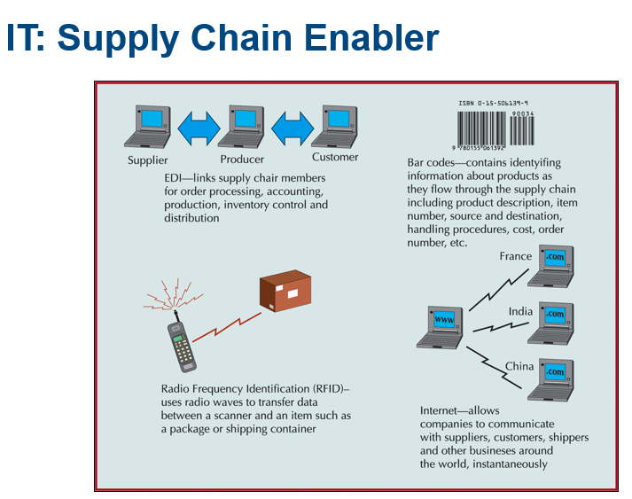

     
## E-Business & Supply Chain Management
-	Savings due to lower transaction costs
-	Reduction of intermediary roles
-	Shorter supply chain response times
-	Wider presence and increased visibility
-	Greater choices & more info for customers
-	Improved service
-	Collection & analysis of huge amounts of customer data & preferences
-	Access to global markets, suppliers & distribution channels

## SCM Software
-	Enterprise resource planning (ERP)
-	software that integrates the components of a company by sharing and organizing information and data

<format style="bold">Collaborative Planning, Forecasting, and Replenishment (CPFR) </format>
-	Two or more companies in a supply chain to synchronize their demand forecasts into a single plan to meet customer demand
-	Parties electronically exchange
    -	 past sales trends
    -	point-of-sale data
    -	on-hand inventory
    -	scheduled promotions
    -	forecasts

## Measuring Supply Chain Performance

Metrics used to measure supply chain performance
1. Inventory TurnOver

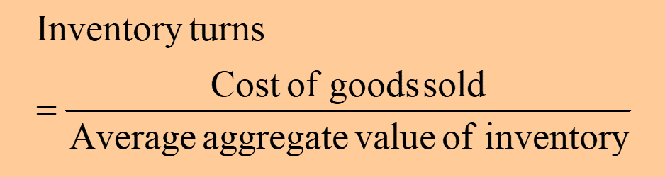

2. Total value (at cost) of inventory

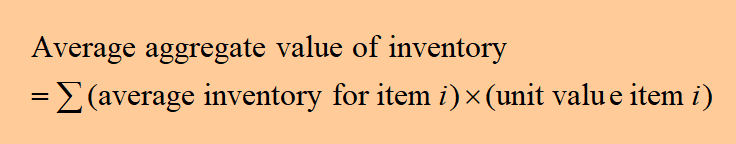

3. Days of supply

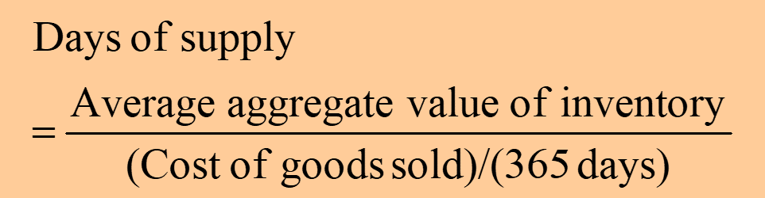

4. Fill rate: fraction of order filled by a distribution center within a specific time period

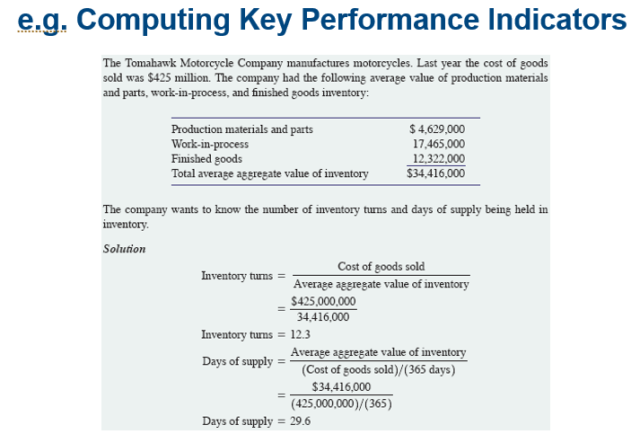

## Process Control and SCOR {id="SCOR_id"}
<format style="bold">	Process Control </format>
-	not only for manufacturing operations
-	can be used in any processes of supply chain

<format style="bold">	Supply Chain Operations Reference (SCOR) </format>
-	a cross industry supply chain diagnostic tool maintained by the Supply Chain Council

- SCOR is about much more than individual
  improvement projects. The ultimate objective of any
  organization that deploys the SCOR model is to build
  a superior supply chain that is integrated with the
  overall organizational strategy. Aided by common
  supply chain definitions, metrics, and strategies,
  the integrated supply chain extends between and
  beyond the walls of the organization that owns the
  customer order.

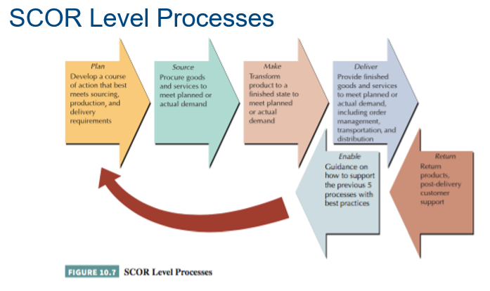

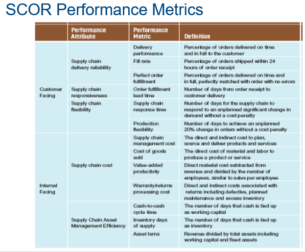

## Procurement {id="procurement_id"}
-	The purchase of goods and services from suppliers
-	On-demand (direct-response) delivery
	- requires the supplier to deliver goods when demanded by the customer
-	Continuous replenishment
	 - supplying orders in a short period of time according to a predetermined schedule
-	Cross enterprise teams
	 - coordinate processes between a company and its supplier
     - <format style="bold">   Supply Chain Integration </format>

### Procurement & Supply Chain Design
-	A <format style="bold"> push system </format> produces goods in advance of customer demand using a forecast of sales 
and moves them through supply chain to points of sale where they are stored as finished goods inventory.
-	A <format style="bold"> pull system </format> produces only what is needed at upstream stages in the supply chain in response to customer demand signals from downstream stages.

Procurement Strategy in designing the supply chain
•	Effective procurement strategy supports an efficient supply chain design
•	Decisions made in ‘how we buy’ critical to supply chain efficiency and success

<format style="bold"> Push and Pull systems </format>

### Procurement Strategy in designing the supply chain
- Effective procurement strategy supports an efficient supply chain design
- Decisions made in ‘how we buy’ critical to supply chain efficiency and success

 

### E-Procurement
-	Direct purchase from suppliers over the Internet, by using software packages or through e-marketplaces, e-hubs, and trading exchanges
-	Can streamline and speed up the purchase order and transaction process
-	What can companies buy over the Internet?
	 - Manufacturing inputs
        - the raw materials and components that go directly into the production process of the product
     - Operating inputs
        - maintenance, repair, and operation goods and services
-	E-marketplaces (e-hubs)
	 - Websites where companies and suppliers conduct business-to-business activities
- 	Reverse auction
	 - process used by e-marketplaces for buyers to purchase items; company posts orders on the internet for suppliers to bid on

## Distribution {id="dist_id"}
-	Encompasses all channels, processes, and functions, including warehousing and transportation, that a product passes on its way to final customer
-	Order fulfillment
	 - process of ensuring on-time delivery of an order
-	Logistics
	 - transportation and distribution of goods and services
-	Driving force today is speed
-	Particularly important for Internet dot-coms

<format style="bold"> Order Fulfillment at Amazon </format>

## Warehouse Management Systems
-	Highly automated system that runs day-to-day operations of a Distribution Centre
-	Controls item putaway, picking, packing, and shipping 
- Features
  -	transportation management
  -	order management
  -	yard management
  -	labor management
  -	warehouse optimization
  -	Inventory management

## Vendor-Managed Inventory
-	SMI – Supplier Managed Inventory
-	Manufacturers, rather than vendors, generate orders
-	Stocking information is accessed using EDI
-	A first step towards supply chain collaboration
-	Increased speed, reduced errors, and improved service

## Collaborative Logistics and Distribution Outsourcing {id="outsource_id"}
-	Collaborative planning, forecasting, and replenishment create greater economies of scale
-	Internet-based exchange of data and information
-	Significant decrease in inventory levels and costs and more efficient logistics
-	Companies focus on core competencies

## Transportation
-	Rail
	 - low-value, high-density, bulk products, raw materials, intermodal containers
	 - not as economical for small loads, slower, less flexible than trucking
-	Trucking
	 - main mode of freight transport in U.S.
	 - small loads, point-to-point service, flexible
	 - More reliable, less damage than rails; more expensive than rails for long distance
-	Air
	 - most expensive and fastest mode of freight transport
	 - lightweight, small packages <500 lbs
	 - high-value, perishable and critical goods
	 - less theft
-	Package carriers
	 - small packages
     - fast and reliable
	 - increased with e-Business
	 - primary shipping mode for Internet companies

-	Water
  	 - low-cost yet slowest shipping mode
	 - primary means of international shipping
	 - U.S. waterways
-	Intermodal
	 - combines several modes of shipping: truck, water and rail
	 - key component is containers
-	Pipeline
 	 - transport oil and products in liquid form
	 - high capital cost, economical use
	 - long life and low operating cost

## Internet Transportation Exchanges
-	Bring together shippers and carriers
-	Initial contact, negotiations, auctions
-	Examples:
[Freight Quote](https://www.freightquote.com)

## Global Supply Chains {id="globalsupplychain_id"}
<format style="bold">Global supply chains</format>
-	Product design often uses inputs from around the world
-	Some manufacturing and service activities are outsourced to countries where labor and/or materials costs are lower
-	Products are sold globally

<format style="bold">Complexities </format>
-	Language and cultural differences
-	Currency fluctuations
-	Political instability
-	Increasing transportation costs and lead times
-	Increased need for trust amongst supply chain partners

### Obstacles to Global Chain Transactions
-	Increased documentation for invoices, cargo insurance, letters of credit, ocean bills of lading or air waybills, and inspections
-	Ever-changing regulations that vary from country to country that govern the import and export of goods
-	Trade groups, tariffs, duties, and landing costs
-	Limited shipping modes
-	Differences in communication technology and availability

<format style="bold">Duties and Tariffs </format>

## Web-based International Trade Logistic Systems
<format style="bold">International trade logistics web-based software systems 
reduce obstacles to global trade </format>
-	convert language and currency
-	provide information on tariffs, duties, and customs processes
-	attach appropriate weights, measurements, and unit prices to individual products ordered over the Web
-	incorporate transportation costs and conversion rates
-	calculate shipping costs online while a company enters an order
-	track global shipments

## Small Business Concerns
Three small business SCM concerns:
1. Inventory management
    - Carry extra inventory as a way to avoid shortages due to supply chain interruption
    - Have backups for delivery from suppliers and to customers
2. Reducing risks
    - Use only reliable suppliers
    - Determine which suppliers are critical and get to know them and any challenges they have
    - Measure supplier performance
    - Recognize warning signs of supplier issues
    - Have plans in place to manage supply chain problems
3. International trade
   - Work with someone who has expertise to help oversee foreign suppliers
   - Set expectations for demand and timing
   - Do not rely on a single supplier
   - Build goodwill to help in negotiations and resolving any problem that arise
   - Consider using domestic suppliers if the risks of working with foreign suppliers are prohibitive

