# Lesson 9 Forecasting

## Lecture Outline
- Forecasting and issues related to forecasting
- Strategic Role of Forecasting in Supply Chain Management
- Components of Forecasting Demand
- Time Series Methods
- Forecast Accuracy

## Forecast
- A statement about the future value of a variable of interest

- We make forecasts about such things as weather, demand, and resource availability
Forecasts are important to making informed decisions

### Two Important Aspects of Forecasts
- <format style="bold"> Expected level of demand: </format> The level of demand may be a function of some structural variation such as trend or seasonal variation
- <format style="bold">Accuracy:</format> Related to the potential size of forecast error

### Forecasts in Business Organizations
- Accounting. 
  - New product/process cost estimates, profit projections, cash management.
- Finance. 
  - Equipment/equipment replacement needs, timing and amount of funding/borrowing needs.
- Human resources. 
  - Hiring activities, including recruitment, interviewing, and training; layoff planning, including outplacement counseling.
- Marketing. 
  - Pricing and promotion, e-business strategies, global competition strategies.
- MIS 
  - New/revised information systems, internet services.
- Operations. 
  - Schedules, capacity planning, work assignments and workloads, inventory planning, make-or-buy decisions, outsourcing, project management.
- Product/service design 
  - Revision of current features, design of new products or services.

### Issues related to forecasting:
- What is the point/reason for forecasting?
- When can you not use forecasting?
- What are some of the key variables in the forecasting process?
- What does forecasting mean to management?
- What assumptions are being used in the forecasting process?
- Macro or micro issues?

### Forecasting Approaches
<format style="bold"> Qualitative forecasting</format>
- Qualitative techniques permit the inclusion of soft information such as:
    - Human factors
    - Personal opinions
    - Hunches
- These factors are difficult, or impossible, to quantify
<format style="bold">Quantitative forecasting</format>

- These techniques rely on hard data
- Quantitative techniques involve either the projection of historical data or the development of associative methods that attempt to use causal variables to make a forecast

## Supply Chain Management
- Accurate forecasting determines inventory levels in the supply chain
- Continuous replenishment
   - supplier & customer share continuously updated data
   - typically managed by the supplier
   - reduces inventory for the company
   - speeds customer delivery

- Variations of continuous replenishment
  - quick response
  - JIT (just-in-time)
  - VMI (vendor-managed inventory)
  - stockless inventory
  - Variation – using Twitter

<format style="bold">The need for forecasts in a value chain</format>

<format style="bold">The effect of inaccurate Forcasting</format>

## Forecasting

<format style="bold">Quality Management</format>

- Accurately forecasting customer demand is a key to providing good quality service
- Which then has an impact on the supply forecasts which flow through to supply chain management issues

<format style="bold">Strategic Planning </format>

- Successful strategic planning requires accurate forecasts of future products and markets

### Steps in the forecasting process:

1.  Determine the purpose of the forecast
    (how will it be used and when will it be needed?)
2.  Establish a time horizon
    (Must indicate a time horizon)
3.  Obtain, clean, and analyse appropriate data
    (Getting good data; cleaning up data, outliers)
4.  Select a forecasting technique
5.  Make the forecast
    Monitor the forecast
    Ask ‘what if’ questions

### Types of Forecasting Methods
Depend on:
- time frame
- demand behavior
- causes of behavior

#### Time Frame
Indicates how far into the future is forecast 

<format style="bold">Short- to mid-range forecast</format>

- typically encompasses the immediate future
- daily up to two years

<format style="bold">Long-range forecast</format>
   
- usually encompasses a period of time longer than two years

#### Demand Behavior
<format style="bold">Trend </format>

- a gradual, long-term up or down movement of demand

<format style="bold">Random variations</format>

- movements in demand that do not follow a pattern

<format style="bold">Cycle</format>

- an up-and-down repetitive movement in demand

<format style="bold">Seasonal pattern</format>

- an up-and-down repetitive movement in demand occurring periodically

### Forcasting Methods
<format style="bold">Forms of Forecast Movement</format>

<format style="bold">Classification of Basic Forecasting Methods</format>

#### Forecasting Methods
<format style="bold"> Time series </format>

- statistical techniques that use historical demand data to predict future demand

<format style="bold">Regression methods </format>
 
- attempt to develop a mathematical relationship between demand and factors that cause its behavior

<format style="bold">Qualitative (Judgmental) </format>

- use management judgment, expertise, and opinion to predict future demand

#### Qualitative Methods
- Management, marketing, purchasing, and engineering are sources for internal qualitative forecasts
- Delphi method
  - involves soliciting forecasts about technological advances from experts

<format style="bold">Qualitative (judgemental) Methods </format>

<format style="bold">Forecasting Process</format>

#### Statistical Methods: Time Series
- Assume that what has occurred in the past will continue to occur in the future 
- Relate the forecast to only one factor - time
- Include
  - moving average
  - exponential smoothing
  - linear trend line

#### Moving Average
<format style="bold"> Naive forecast </format>

- demand in current period is used as next period’s forecast

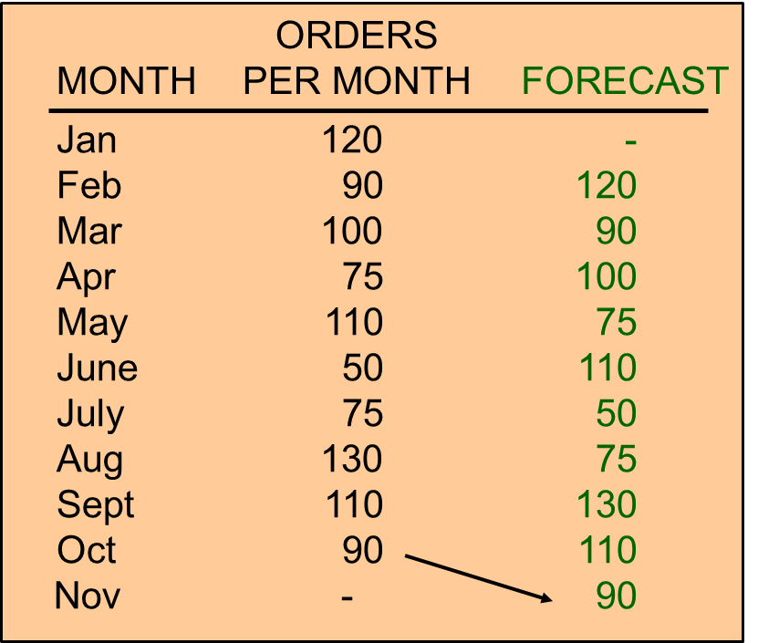

<format style="bold">Simple moving average </format>

- uses average demand for a fixed sequence of periods
- stable demand with no pronounced behavioral patterns

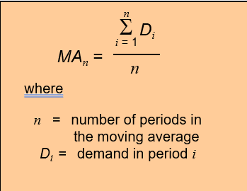

<format style="bold">3-month Simple Moving Average</format>

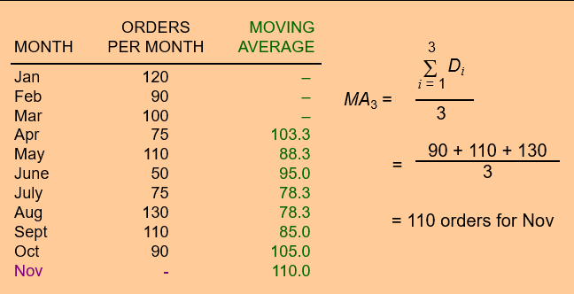

<format style="bold">5-month Simple Moving Average</format>

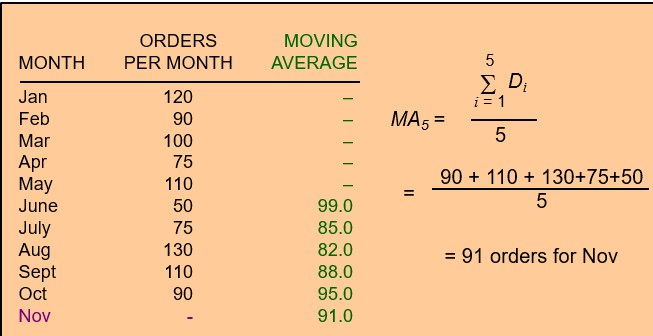

<format style="bold">Smoothing Effects</format>

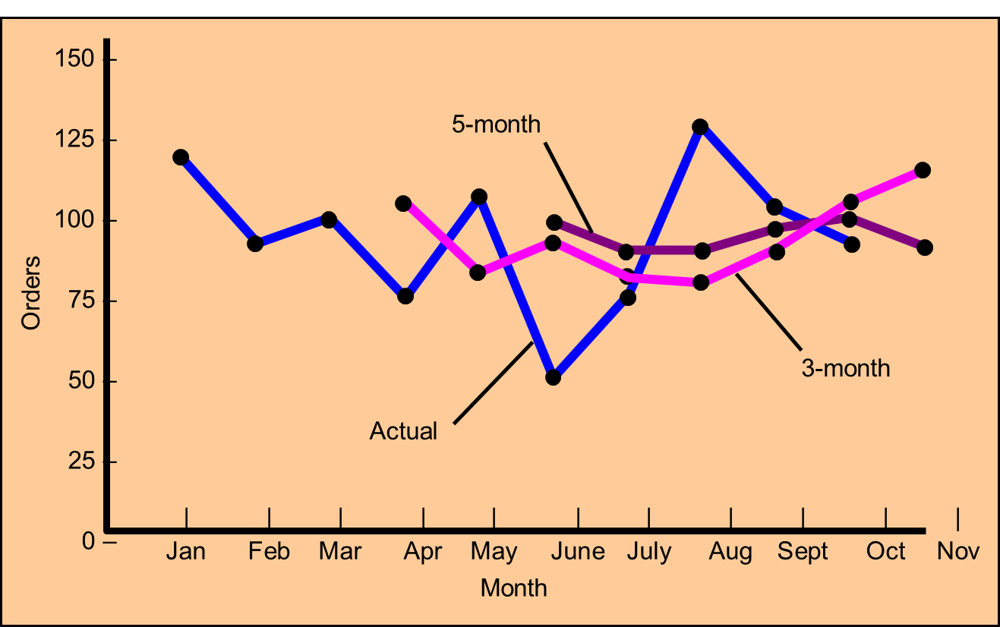

<format style="bold">Weighted moving average</format>

- weights are assigned to most recent data

- Adjusts moving average method to more closely reflect data fluctuations

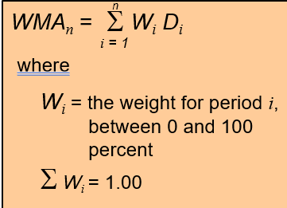

<format style="bold">Weighted Moving Average Example</format>

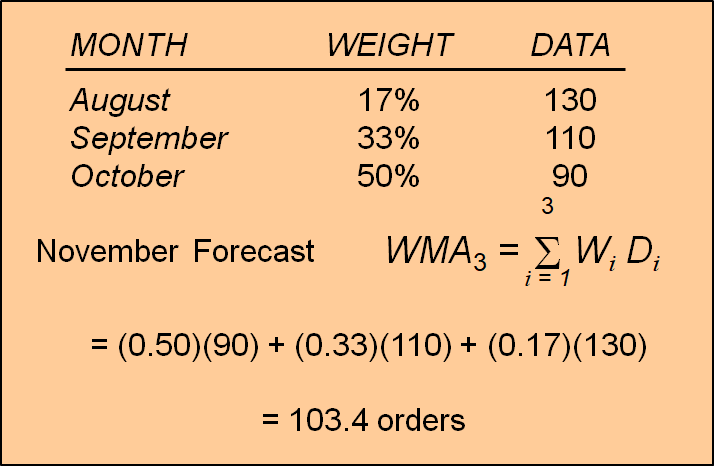

### Exponential Smoothing
- Averaging method
- Weights most recent data more strongly
- Reacts more to recent changes
- Widely used, accurate method

<format style="bold">Exponential Smoothing</format>

<format style="bold">Effect of Smoothing Constant</format>

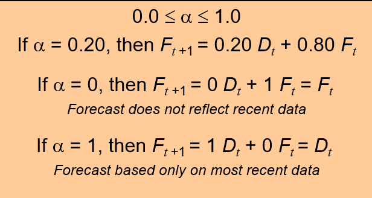

### Seasonal Adjustments
- Repetitive increase/ decrease in demand
- Use seasonal factor to adjust forecast

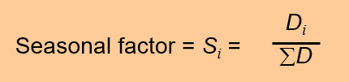

### Forecast Accuracy
<format style="bold"> Forecast error</format>

- difference between forecast and actual demand

<format style="bold">MAD</format>

- mean absolute deviation

<format style="bold">MAPD</format>

- mean absolute percent deviation
<format style="bold">Cumulative error</format>
<format style="bold">Average error or bias</format>

<format style="bold">Forecast error (et) is the difference between the observed value of the time series and the forecast,
or At – Ft. </format>

<format style="bold">Mean Square Error (MSE) </format>

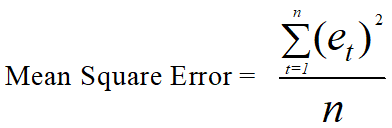

<format style="bold">Mean Absolute Deviation Error (MAD)</format>

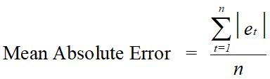

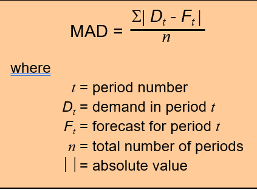

<format style="bold">MAD Example</format>

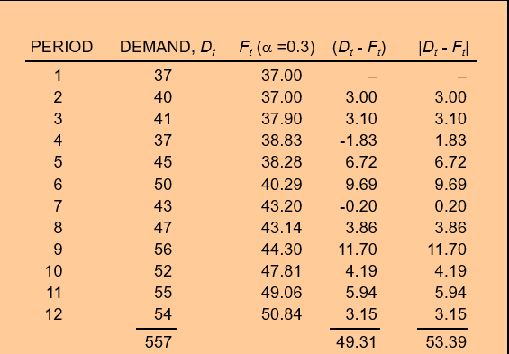

<format style="bold">MAD Calculation</format>

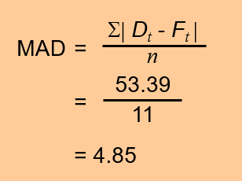

<format style="bold">Mean Absolute Percentage Error (MAPE)</format>

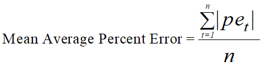

<format style="bold">Other Accuracy Measures</format>

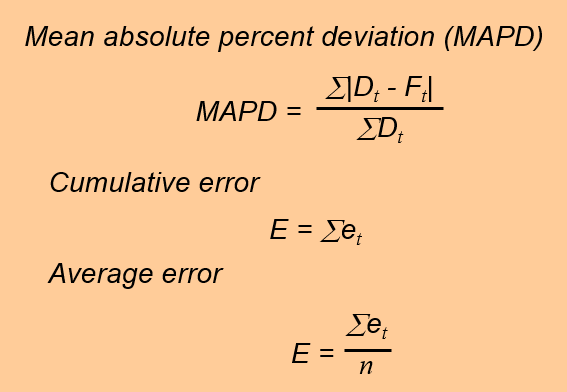

<format style="bold">Comparison of Forecasts</format>

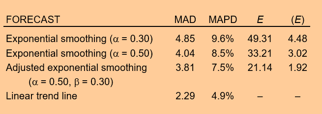

### Choosing a forecasting technique
- Cost
- Accuracy
- Availability of data
- Availability of resources, expertise
- Forecast horizon
- Use multiple techniques where relevant.

And if you get it wrong…

### Operations Strategy & Forecasting
- The better forecasts are, the more able organizations will be to take advantage of future opportunities and reduce potential risks
    - A worthwhile strategy is to work to improve short-term forecasts
        - Accurate up-to-date information can have a significant effect on forecast accuracy:
            - Prices
            - Demand
            - Other important variables
- Reduce the time horizon forecasts have to cover
- Sharing forecasts or demand data through the supply chain can improve forecast quality

### Summary:

- Forecasting is an integral part of managing operations
- Forecasting is an attempt to predict the future, using the best available data
- There are a range of forecasting methods
- No method is infallible
- All forecasting relies on the quality and quantity of the available information
- The data generated by forecasting is used to make decisions – the data of itself will not decide for you 

